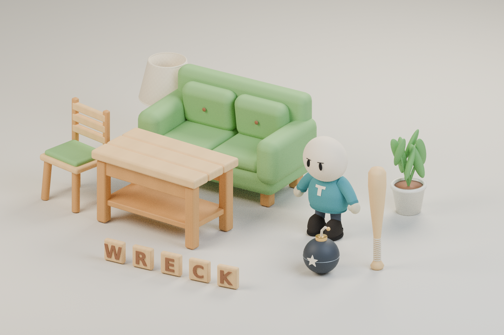
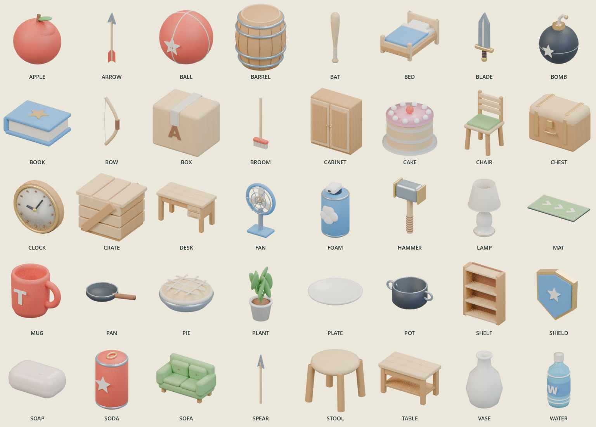
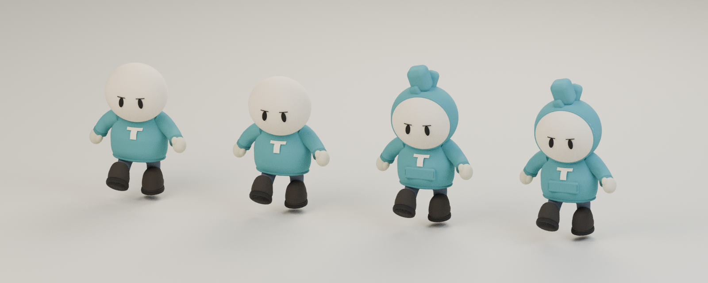

# Supplied asset audit and integration

This audit covers the actual laptop project's imported FBXs and generated material
library. The earlier independent toybox candidates are separate and have not been
substituted for these models. The sheet and icons are renders of the supplied meshes.



## Assessment

| Criterion | Rating | Evidence and implication |
| --- | ---: | --- |
| Cohesive art direction | 7/10 | Warm wood, cream ceramics, green upholstery, rounded furniture and a small clothed avatar work together. The exaggerated scale is suitable for a playful toy-house setting. |
| Object recognition | 8/10 | Sofa cushions/buttons, the table's lower shelf, padded chair, lamp shade, bomb fuse, bat grip and raised tile letters remain readable as different objects. The supplied 40-item contact sheet records the wider inventory. |
| Surface realism | 5/10 | Materials include actual wood/cloth pattern maps and normal maps, but finish is very clean and regular. Ceramic and upholstery lack much local roughness variation; foliage is a cluster of smooth leaf forms. These are stylized believable shapes, not photorealistic objects. |
| Supplied mobile budget readiness | 4/10 | The original delivery has no LODs or measured phone frame time. Its default avatar has 31,696 triangles, six skinned renderers and nine material slots. The separately validated browser clothing LOD below reduces geometry, while draw-call and scene budgets still need measurement. |

These are art assessments from the rendered models and file inspection, not a
rating of a successfully tested complete game. The PlayMode/native build gate is
separate. A renderer/material slot can produce a draw call even when the geometry
is joined into one mesh; triangle counts alone do not establish performance.



The 40 rendered item icons make the full inventory inspectable. The room-module and
VFX sets were technically checked, but not all were independently reviewed at game
camera scale. Environmental readability, lighting, overdraw and hazard clarity need
the complete arena view.

The icon sheet also exposes specific UI risks: normalized ARROW and SPEAR thumbnails
look similar, while the pale PLATE silhouette has weak contrast against a cream
surface. Recipe names, handling labels and contrasting button backgrounds should
disambiguate them rather than treating every supplied thumbnail as automatically
successful UI art.

## Technical evidence

The pipeline reports and files contain 98 models: 40 items, 26 letter tiles, 21
environment modules, ten VFX meshes and one shared avatar. The FBX imports match
their report's triangle counts and metre-scale bounds. Checks found no degenerate
triangles, opposed corner normals or invalid unit normals in the supplied meshes.

The avatar contains 22 bones, 11 modular meshes and 17 genuine skeletal clips. FBX
also exposes 17 empty shape-key actions; the browser exporter excludes those rather
than advertising them as additional playable animations. The default outfit enables
the head, Crewneck, Joggers, Mittens, Boots and T badge, disabling overlapping optional
Hoodie/Hood/Cap/Glasses/Satchel meshes until selected.

| Avatar mesh | Triangles | Default outfit |
| --- | ---: | --- |
| Head | 7,504 | Yes |
| Crewneck | 9,472 | Yes |
| Joggers | 2,240 | Yes |
| Mittens | 4,464 | Yes |
| Boots | 7,616 | Yes |
| T badge | 400 | Yes |
| Hoodie | 9,880 | Optional |
| Hood | 16,944 | Optional |
| Cap | 2,340 | Optional |
| Glasses | 786 | Optional |
| Satchel | 1,464 | Optional |

The file contains 63,110 triangles with all wardrobe meshes, versus 31,696 in the
default visible combination. Four default avatars cost 126,784 visible triangles
and 36 material slots before room geometry, furniture, held items, tiles or effects.
The source crate has 7,776 triangles and kitchen stove 8,064; repeatedly placing
these models also needs a scene-level budget. Original FBXs and authored outputs
remain unchanged.

## Validated mobile avatar derivative



The columns show full default, mobile default, full hoodie with hood, and mobile
hoodie with hood. All use the same orthographic camera, lighting and Run animation
frame. The clothed silhouette, mittens, boots and facial readability remain close;
minor collar/hood-edge highlights differ. The image is a model comparison, not a
device performance test or a complete animation review.

`avatar-mobile.glb` collapses clothing geometry to approximately 42% of its original
triangle count. The supplied head and both facial morph targets remain intact.
The default outfit falls from 31,696 to **17,660 triangles (44% fewer)**; the complete
wardrobe falls from 63,110 to **30,848 (51% fewer)**. Four default avatars therefore
cost 70,640 visible triangles in this derivative. Its default six skinned renderers
and nine material slots remain unchanged. The GLB download is 5,736,680 bytes versus
7,130,212 for the full-detail file; it includes optional wardrobe and animations.

The derivative keeps all eleven modular meshes and 22 bones. A strict verifier
caught Blender's import/export frame sampling shortening every clip. The dedicated
`gltf_avatar_animation.py` step first proves the named hierarchy and rest basis
match (maximum roundtrip delta 6e-8), then copies the original 17 clips' 1,122
channels, time/value bytes, interpolation and inverse-bind matrix bytes without
resampling. The independent verifier confirms exact preservation. Skin weights,
joint indices, normals and morph accessor bounds pass; maximum static bounds change
is 0.28 mm. `avatar-mobile-audit.json` records counts and source/output hashes, while
the comparison metadata records the exact GLBs rendered.

The manifest exposes `avatar.mobilePath` alongside the full-detail `avatar.path`.
Browser selection uses the mobile derivative for coarse-pointer/mobile rendering
and preserves the full-detail fallback. This does not reduce material draw calls,
establish phone FPS, or provide a native Unity LOD. Those remain separate gates.

## Corrections and integration

The first web interchange render exposed an actual defect: Blender 4.3 retained
the neutral texture maps but dropped authored tint factors behind a legacy Multiply
node, turning the wood and sofa white. The export pipeline now restores material
factors from `Data/Generated/materials.json` and first checks that embedded texture
bytes remain identical, avoiding an accidental second tint on baked images. This
passed 275 material checks and 144 embedded PNG hash comparisons.

`verify_web.py` independently checks 98 supplied-model GLBs and the mobile derivative: container/accessor bounds, index
counts, normals, skin weight normalization, transformed model bounds, material
factors, texture hashes, manifest hashes, the 22-bone set and the exact 17-clip set.
The final report is `Web/public/art/verify.json`, with 99 checked and zero failed.
`audit.json` records source FBX hashes and mesh facts. These checks do not prove
Unity import or in-game frame rate.

Browser art uses Y-up metres and a fixed export-parent half turn to compensate for
the source pipeline's Unity/glTF handedness difference. This preserves animated
local transforms and makes the visible avatar face +Z. Item grips and bounds are
recorded in `manifest.json`; item icons use the same meshes and materials.

Unity source integration now provides:

- `ModelVisual` placement, imported bounds and grip helpers that preserve FBX root
  rotations instead of laying models on their sides.
- `PlayerAppearance` imported avatar visibility, compatible wardrobe combinations,
  cosmetic colour/skin persistence and canonical clip playback through Playables.
- Imported furniture silhouettes while retaining `LetterBuilt` metadata and one
  origin per word letter, so breaking SOFA still produces exactly S, O, F and A.
- Original furniture toughness derived from the current rules rather than a fixed
  placeholder health value.
- Supplied letter meshes laid onto their broad faces for the overhead camera, with
  a matching physical box and one underside label for a tumbled tile. The old
  duplicate top/side labels are hidden when imported art is available.

Imported furniture currently uses a measured box collision proxy. This is stable
for gameplay but does not provide a physically open chair/sofa silhouette; compound
seat/back/leg colliders are a separate refinement. Unknown words retain the legacy
fallback, so maps/checklists should use known model keys. Missing imported art must
not be mistaken for an accepted final visual.

The native editor needs a valid Unity license and `ProjectSetup.Run` / **Set Up
Imported Art** to populate actual imported clip references; no serialized clip IDs
were guessed. Native animation, collision placement and game-camera tests remain
required before accepting this as a complete Unity release.

## Reproduce

Run one Blender job at a time and separate it from Unity build/test runs:

```sh
blender -b --factory-startup --python-exit-code 1 --python Tools/AssetPipeline/export_web.py -- --repo .
python Tools/AssetPipeline/verify_web.py --repo .
blender -b --factory-startup --python-exit-code 1 --python Tools/AssetPipeline/render_supplied.py
blender -b --factory-startup --python-exit-code 1 --python Tools/AssetPipeline/render_icons.py
blender -b --factory-startup --python-exit-code 1 --python Tools/AssetPipeline/export_mobile_avatar.py -- --repo .
python Tools/AssetPipeline/verify_web.py --repo .
blender -b --factory-startup --python-exit-code 1 --python Tools/AssetPipeline/render_avatar_lod.py
python Tools/AssetPipeline/promote_mobile_avatar.py --repo .
```

The supplied FBXs, original material/texture files and their existing pipeline
reports are preserved. These dedicated scripts regenerate web derivatives, actual
model renders and technical checks without manually editing generated art.
